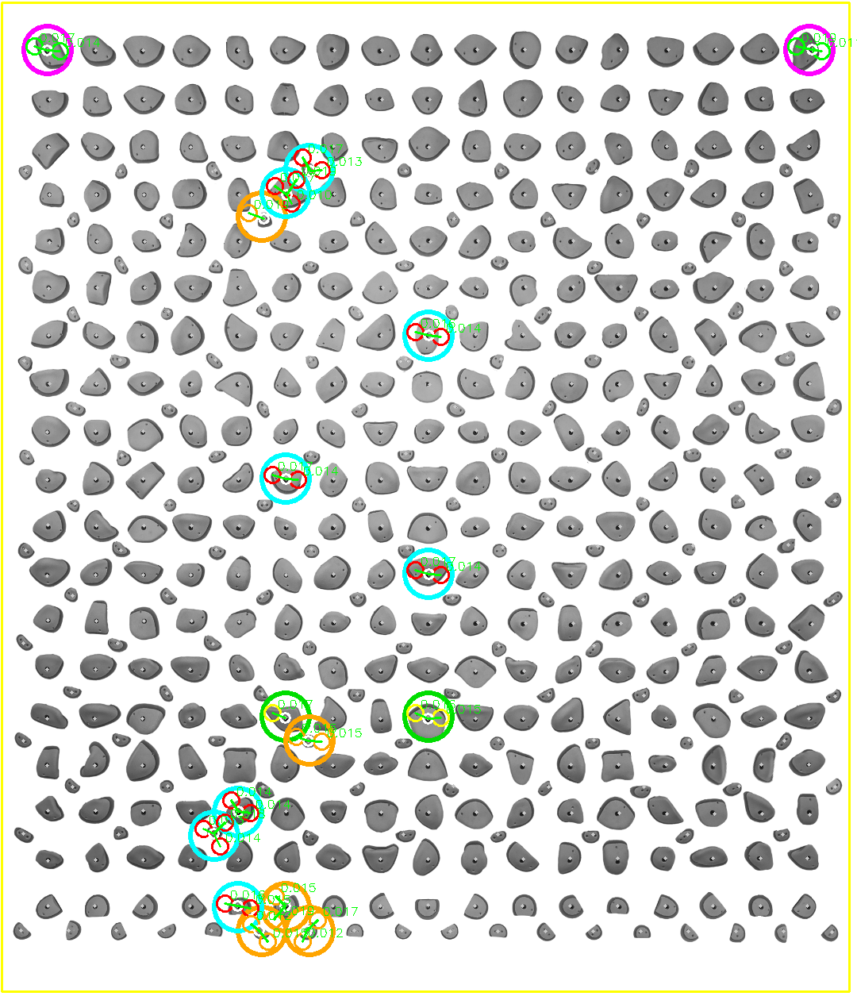

# DiffKilter: Discrete Diffusion Climb Generation

[](https://huggingface.co/spaces/YKaravayeu/DiffKilter)
[](https://www.python.org/downloads/)
[](https://pytorch.org/)

When training for climbing on a board, it can be difficult to search/think of problems that do exactly what you want to work on. Sometimes you just need a helping hand creating a climb that does the exact movement that you want to do. DiffKilter helps create a problem by selecting specific holds and having it generate a route around them.

I have been hooked on the concept of Machine Learning (ML) and wanted to do some personal research projects to get deep into it all! This is an end-to-end (ML) pipeline that generates novel climbing routes for a Kilterboard. It utilises a custom **Transformer Encoder** trained via **Absorbing Discrete Diffusion** and features a Gradio web interface for interactive route generation.

## How To Use

Just select the hold type you want and click on the hold to give it that hold type. If you just want to generate a climb with no selected holds, just click Generate Route!

<p align="center">

</p>

## The ML Architecture

The majority of diffusion models use continuous models to generate by denoising Gaussian noise. This project utilises **discrete** denoising diffusion because climbs use distinct holds with categorical concepts (Start, Hand, Foot, Finish, Empty).

Initially, I was inspired by J Austin et al.'s paper, ["Structured Denoising Diffusion Models in Discrete State-Spaces"](https://arxiv.org/abs/2107.03006), but eventually moved away into an **Absorbing Discrete Diffusion Model** due to difficulties with ensuring token similarities between time steps. This mode has the following process:

**Forward Process:** Climbing holds are progressively corrupted into a single absorbing `[MASK]` state over $T$ timesteps based on a linear noise schedule.

**Reverse Process**: The model learns to predict the original unmasked board. During inference, the schedule unmasks a percentage of holds, clamping user-defined holds with inpainting (borrowed from image generation) at every step. This keeps token similarity.

**The Model:**
A custom PyTorch Transformer Encoder utilising three embeddings to create the climbs:
1. **Token Embeddings:** Categorical class of the hold.
2. **Spatial Embeddings:** Normalised physical $(x, y)$ coordinates of the holds on the 2D board.
3. **Time Embeddings:** Sinusoidal positional encodings to represent the diffusion timestep $t$.
* **Loss:** Trained using **Focal Loss** to penalise model for missing rare important holds (like Starts/Finishes) while ignoring class imbalance of the most empty board.

<p align="center">

</p>

## Data Collection Pipeline

While some databases do exist for climbs, like [BoardLib](https://github.com/lemeryfertitta/BoardLib), I wanted to go down this research path by doing every step from start to finish by myself. To go about this, I built a custom scraper from scratch that can be found in the `/data_collection` directory.

---

* **Android Automation:** Uses `adb shell` commands to interface with an android emulator (BlueStacks in my case), automatically swiping throught the climbs on the Kilter app. NOTE: Kilter only allows 1000 swipes before restarting to the first climb that is chosen.
* **Computer Vision Calibration:** Uses OpenCV to calculate a Homography matrix to map screen pixels to normalised board coordinates.
* **Image Processing and OCR:** Utilises HSV colour masking to classify holds by their rings on the Kilter app, and Tesseract OCR to extract route names, grades, and setter metadata.

<p align="center">

</p>

If a different kilterboard is required to generate climbs, the process of datascraping could be performed again with the data collection pipeline found within `/data_collection`. If a different board is required altogether, assuming there is horizontal rows of holds, data scraping can also be achieved with the code with some changes to HSV colours and how the LEDs light up on respective apps.

## Repository Structure

```text
├── app.py                  # Gradio Web UI and KDTree-based interactive rendering
├── diffusion.py            # Absorbing diffusion math and constrained generation
├── model.py                # PyTorch Transformer, Spatial, and Sinusoidal embeddings
├── dataset.py              # PyTorch Dataset class with spatial coordinate normalization
├── train.ipynb             # Model training loop, checkpointing, and evaluation
├── checkpoints/            # (Ignored by Git) Local model weights
│   └── kilter_checkpoint_epoch_100.pt
├── data/                   # (Ignored by Git) Local dataset files
│   └── kilter_board_climbs.npz
└── data_collection/        # Custom data scraping pipeline
    ├── Kilterboard_Scrape.py  # Main scraping loop (ADB, HSV Masking, OCR)
    ├── make_layout_rows.py    # Interactive GUI coordinate calibration
    ├── config.json            # Homography matrix and bounding boxes
    ├── layout.json            # Normalized (x, y) Kilterboard coordinate map
    ├── colors.json            # HSV color boundaries for Start/Hand/Foot/Finish
```

## Installation & Local Usage

To keep this repository lightweight, the raw dataset and trained model weights are hosted on Hugging Face.

1. **Clone the Repository:**

```bash
git clone [https://github.com/YanKaravayeu/DiffKilter.git](https://github.com/YanKaravayeu/DiffKilter.git)
cd DiffKilter
pip install -r requirements.txt
```

2. **Download the Data & Weights:**

**Dataset**: Download `kilter_board_climbs.npz` from [Hugging Face Dataset](https://huggingface.co/datasets/YKaravayeu/DiffKilter_climbs/tree/main) and place it in the `/data` folder.

**Model Weights:** Download `kilter_checkpoint_epoch_100.pt` from [Hugging Face Models](https://huggingface.co/YKaravayeu/DiffKilter/tree/main) and place it in the `/weights` folder.

3. **Launch the App:**

```bash
python app.py
```

Open `http://127.0.0.1:7860` in your browser and start generating climbs!

## Future Improvements and Implementations

* Add evaluations and baselines to measure the effective of the model and get some quantitative insights.
* Implement a classifer so that users can received generated climbs for specific difficulties (i.e. generate a V6 climb using specific holds).
* Improve on the model with finetuning, or use BoardLib to train on more climbs compared to the 17,000 that I could scrape.

Thank you for checking out my repository, if you have ANY feedback for this, please do let me know! Contact: YanKaravayeu@gmail.com